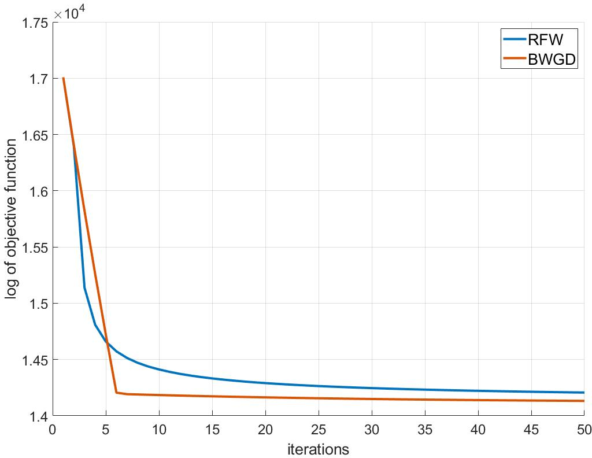
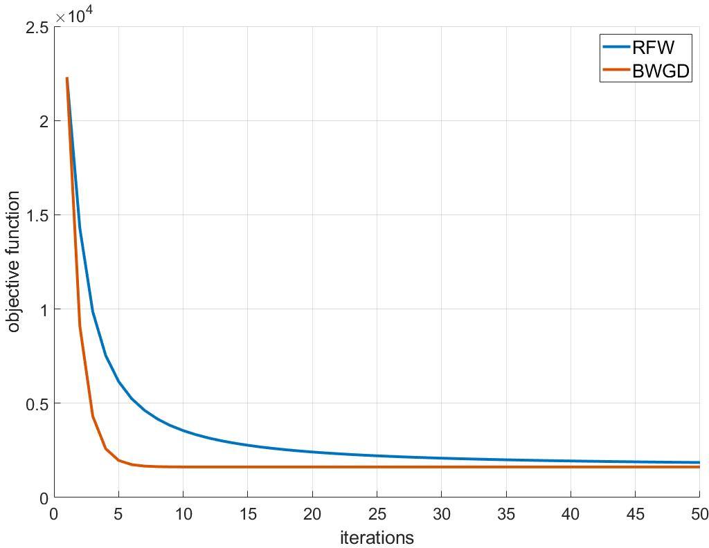
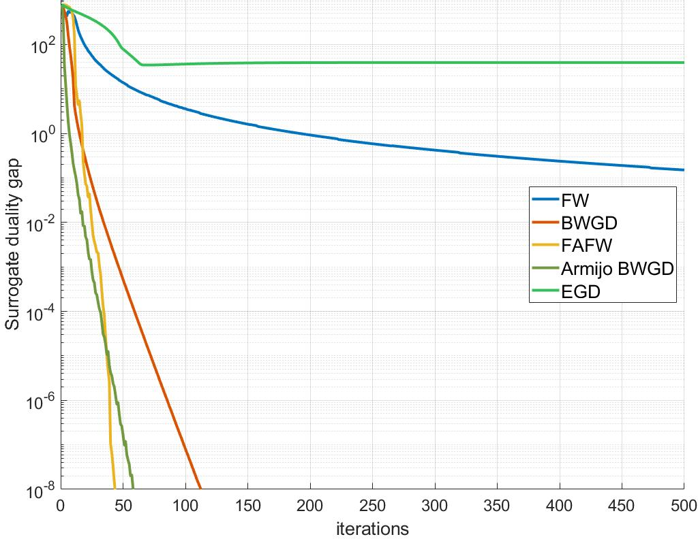
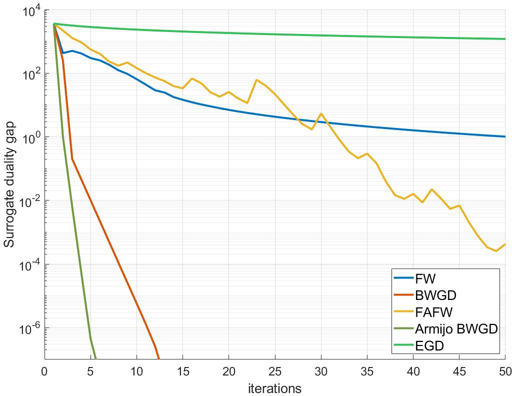

# ProjBWGD

## Notice

Running the code requires SDP solver MOSEK in MATLAB (<a href="https://www.mosek.com/downloads/" title="超链接title">download link</a>),\
and adding the corresponding path "Mosek/Mosek version/toolbox/MATLAB version"(avoid warning: solver not found).

## comparison between ProjBWGD and Riemannan Frank-wolfe [1, 2]
Consider problem 
$$\min_{A \preceq \Sigma \preceq B} \sum_{i=0}^N \beta_i d^2(\Sigma, \Sigma_i)$$
where $A, B$ are two pre-determined SPD matrces with $A \preceq B$. 

run constrained_BWM.m to recover case 1 result 

run constrained_BWM_2.m to recover case 2 result

* **Case 1:** the unconstrained minimum lies within the interior of the interval (i.e., the constrained optimum also lies in the interior of the interval)

* **Case 2:** the unconstrained minimum lies outside the interval (i.e., the constrained optimum lies on the boundary of the interval).

## WDRO-MMSE problem:
$$
\begin{align*}
    \min_{\Sigma_x,\Sigma_w} & -\text{tr}\big(\Sigma_x - \Sigma_x H^\top (H\Sigma_x H^\top+\Sigma_w \big)^{-1} H \Sigma_x\big)  \\
    &\text{ s.t. } \Sigma_x \in \mathcal{W}(\widehat{\Sigma}_x,\rho_x), \Sigma_w \in \mathcal{W}(\widehat{\Sigma}_w,\rho_w).
\end{align*}
$$

run WDRO_MMSE.m to recover result 

## Constrainted Barycenter problem:
$$
\begin{align*}
    \min_{\Sigma \in \mathcal{W}(\widehat{\Sigma},\rho)} \sum_{i=0}^N \beta_i d^2(\Sigma, \Sigma_i).
\end{align*}
$$

run constraned_barycenter.m to recover result

[1] Weber, Melanie, and Suvrit Sra. "Projection-free nonconvex stochastic optimization on Riemannian manifolds." IMA Journal of Numerical Analysis 42.4 (2022): 3241-3271.

[2] Weber M, Sra S. Riemannian optimization via Frank-Wolfe methods[J]. Mathematical Programming, 2023, 199(1): 525-556.
