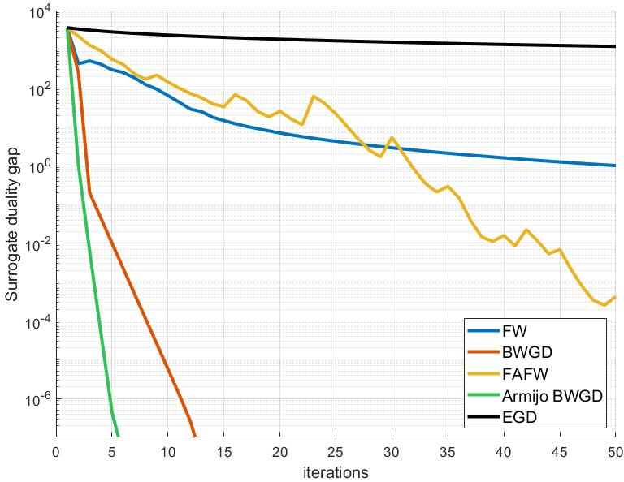
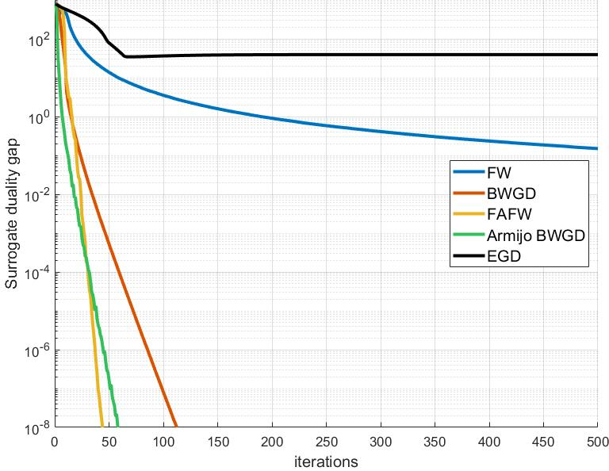

# ProjBWGD

Code of paper "On the Convergence of Projected Bures-Wasserstein Gradient Descent under Euclidean Strong Convexity" ICML 2024

## Notice

Running the code requires SDP solver MOSEK in MATLAB (<a href="https://www.mosek.com/downloads/" title="超链接title">download link</a>),\
and adding the corresponding path "Mosek/Mosek version/toolbox/MATLAB version"(avoid warning: solver not found).

## Barycenter problem with matrix interval constraint
RFW represents Riemannan Frank-wolfe method [1, 2]

run constrained_BWM.m to recover case 1 result 

run constrained_BWM_2.m to recover case 2 result

* **Case 1:** the unconstrained minimum lies within the interior of the interval (i.e., the constrained optimum also lies in the interior of the interval)

* **Case 2:** the unconstrained minimum lies outside the interval (i.e., the constrained optimum lies on the boundary of the interval).

## Barycenter problem with Wasserstein ball constraint:

run constraned_barycenter.m to recover result

## WDRO-MMSE problem:

run WDRO_MMSE.m to recover result 

[1] Weber, Melanie, and Suvrit Sra. "Projection-free nonconvex stochastic optimization on Riemannian manifolds." IMA Journal of Numerical Analysis 42.4 (2022): 3241-3271.

[2] Weber M, Sra S. Riemannian optimization via Frank-Wolfe methods[J]. Mathematical Programming, 2023, 199(1): 525-556.
